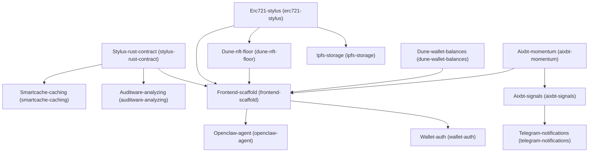

# Architecture

## Dependency Graph

## Execution / Implementation Order

1. **Stylus-rust-contract** (`55470ce1`)
2. **Erc721-stylus** (`34aead19`)
3. **Aixbt-momentum** (`0db99056`)
4. **Dune-wallet-balances** (`b8548fa9`)
5. **Smartcache-caching** (`28c26bae`)
6. **Auditware-analyzing** (`c15a93ff`)
7. **Ipfs-storage** (`96b5395e`)
8. **Dune-nft-floor** (`cbe38818`)
9. **Aixbt-signals** (`bf5f77f0`)
10. **Frontend-scaffold** (`17917c17`)
11. **Telegram-notifications** (`6237fdea`)
12. **Openclaw-agent** (`be978e91`)
13. **Wallet-auth** (`476092ba`)
