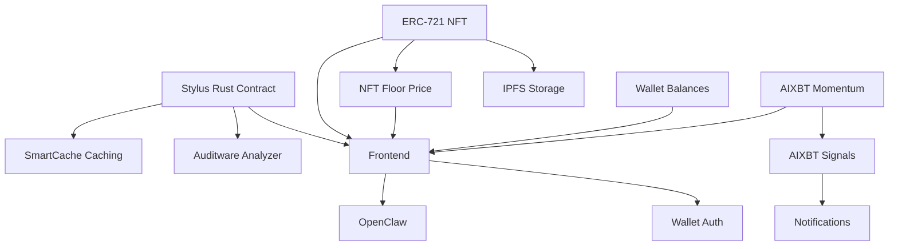

# My App

> A Web3 application composed with [N]skills.

**Network**: Arbitrum Sepolia (Chain ID: 421614) — Testnet
**Keywords**: 

---

## Architecture

## Components

| Component | Type | Category | User Prompt |
|-----------|------|----------|-------------|
| Stylus Rust Contract | `stylus-rust-contract` | contracts | (none) |
| ERC-721 NFT | `erc721-stylus` | contracts | (none) |
| AIXBT Momentum | `aixbt-momentum` | intelligence | (none) |
| Wallet Balances | `dune-wallet-balances` | analytics | (none) |
| SmartCache Caching | `smartcache-caching` | contracts | (none) |
| Auditware Analyzer | `auditware-analyzing` | contracts | (none) |
| IPFS Storage | `ipfs-storage` | app | (none) |
| NFT Floor Price | `dune-nft-floor` | analytics | (none) |
| AIXBT Signals | `aixbt-signals` | intelligence | (none) |
| Frontend | `frontend-scaffold` | app | (none) |
| Notifications | `telegram-notifications` | telegram | (none) |
| OpenClaw | `openclaw-agent` | agents | (none) |
| Wallet Auth | `wallet-auth` | app | (none) |

## Implementation Order

Build the project in this order (respects dependencies):

1. **Stylus Rust Contract** (`stylus-rust-contract`) — see `.nskills/components/stylus-rust-contract--55470ce1.md`
2. **ERC-721 NFT** (`erc721-stylus`) — see `.nskills/components/erc721-stylus--34aead19.md`
3. **AIXBT Momentum** (`aixbt-momentum`) — see `.nskills/components/aixbt-momentum--0db99056.md`
4. **Wallet Balances** (`dune-wallet-balances`) — see `.nskills/components/dune-wallet-balances--b8548fa9.md`
5. **SmartCache Caching** (`smartcache-caching`) — see `.nskills/components/smartcache-caching--28c26bae.md`
6. **Auditware Analyzer** (`auditware-analyzing`) — see `.nskills/components/auditware-analyzing--c15a93ff.md`
7. **IPFS Storage** (`ipfs-storage`) — see `.nskills/components/ipfs-storage--96b5395e.md`
8. **NFT Floor Price** (`dune-nft-floor`) — see `.nskills/components/dune-nft-floor--cbe38818.md`
9. **AIXBT Signals** (`aixbt-signals`) — see `.nskills/components/aixbt-signals--bf5f77f0.md`
10. **Frontend** (`frontend-scaffold`) — see `.nskills/components/frontend-scaffold--17917c17.md`
11. **Notifications** (`telegram-notifications`) — see `.nskills/components/telegram-notifications--6237fdea.md`
12. **OpenClaw** (`openclaw-agent`) — see `.nskills/components/openclaw-agent--be978e91.md`
13. **Wallet Auth** (`wallet-auth`) — see `.nskills/components/wallet-auth--476092ba.md`

## Environment Variables

| Key | Description | Required | Default |
|-----|-------------|----------|---------|
| `STYLUS_RPC_URL` | Arbitrum RPC URL for deployment | Yes | https://sepolia-rollup.arbitrum.io/rpc |
| `DEPLOYER_PRIVATE_KEY` | Private key for deployment | Yes |  |
| `NEXT_PUBLIC_NFT_ADDRESS` | Deployed ERC721 NFT address | No |  |
| `ERC721_DEPLOYMENT_API_URL` | URL of the ERC721 deployment API | No | http://localhost:4001 |
| `AIXBT_API_KEY` | AIXBT API Key for market intelligence | Yes |  |
| `DUNE_API_KEY` | Dune Analytics API key for blockchain data queries | Yes |  |
| `PINATA_API_KEY` | Pinata API key | Yes |  |
| `PINATA_SECRET_KEY` | Pinata secret API key | Yes |  |
| `NEXT_PUBLIC_PINATA_GATEWAY` | Pinata gateway URL | No | https://gateway.pinata.cloud |
| `NEXT_PUBLIC_WALLETCONNECT_PROJECT_ID` | WalletConnect Cloud project ID for wallet connections | Yes |  |
| `NEXT_PUBLIC_APP_NAME` | Application name displayed in wallet dialogs | No | My DApp |
| `TELEGRAM_BOT_TOKEN` | Bot token from @BotFather | Yes |  |

## Key Dependencies

| Package | Version |
|---------|---------|
| `next` | `^14.2.0` |
| `react` | `^18.3.0` |
| `react-dom` | `^18.3.0` |
| `wagmi` | `^2.12.0` |
| `viem` | `^2.21.0` |
| `@tanstack/react-query` | `^5.51.0` |
| `@rainbow-me/rainbowkit` | `^2.1.0` |
| `clsx` | `^2.1.0` |
| `tailwind-merge` | `^2.2.0` |
| `ethers` | `^6.13.0` |
| `lucide-react` | `^0.400.0` |
| `@radix-ui/react-select` | `^2.0.0` |
| `@types/node` | `^20.0.0` |
| `@types/react` | `^18.3.0` |
| `@types/react-dom` | `^18.3.0` |
| `typescript` | `^5.4.0` |
| `eslint` | `^8.57.0` |
| `eslint-config-next` | `^14.2.0` |
| `tailwindcss` | `^3.4.0` |
| `postcss` | `^8.4.0` |
| `autoprefixer` | `^10.4.0` |

## Detailed Component Specs

- [Stylus Rust Contract](.nskills/components/stylus-rust-contract--55470ce1.md)
- [ERC-721 NFT](.nskills/components/erc721-stylus--34aead19.md)
- [AIXBT Momentum](.nskills/components/aixbt-momentum--0db99056.md)
- [Wallet Balances](.nskills/components/dune-wallet-balances--b8548fa9.md)
- [SmartCache Caching](.nskills/components/smartcache-caching--28c26bae.md)
- [Auditware Analyzer](.nskills/components/auditware-analyzing--c15a93ff.md)
- [IPFS Storage](.nskills/components/ipfs-storage--96b5395e.md)
- [NFT Floor Price](.nskills/components/dune-nft-floor--cbe38818.md)
- [AIXBT Signals](.nskills/components/aixbt-signals--bf5f77f0.md)
- [Frontend](.nskills/components/frontend-scaffold--17917c17.md)
- [Notifications](.nskills/components/telegram-notifications--6237fdea.md)
- [OpenClaw](.nskills/components/openclaw-agent--be978e91.md)
- [Wallet Auth](.nskills/components/wallet-auth--476092ba.md)

## Additional Context

- [Project Configuration](.nskills/project.md)
- [Full Architecture Details](.nskills/architecture.md)
- [All Environment Variables](.nskills/environment.md)
- [Verified Dependencies](.nskills/dependencies.md)
- [Scripts Reference](.nskills/scripts.md)
- [Integration Map](.nskills/integration-map.md)

---

*Generated by [[N]skills](https://www.nskills.xyz) — Compose N skills for your Web3 project.*
